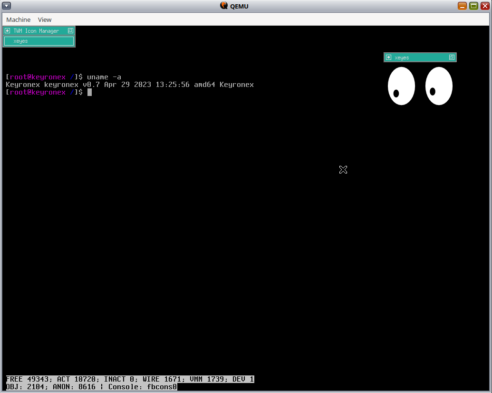

Keyronex is an operating system for 64-bit IBM-compatible PCs and their
emulators. Some preliminary work towards Amiga 68k and Virt68k ports has also
been done. It is purely a hobbyist system and makes no pretences to be anything
else.

A technical description of some parts (only the VMM for now) of Keyronex is
available on the
[Read The Docs](https://keyronex.readthedocs.io/en/latest/index.html) website.

Keyronex features ports of software including the GNU Coreutils, BASH shell,
Binutils, and GCC. Xorg and some basic X11 apps such as Twm and Xeyes also run.
It doesn't do anything useful or interesting yet.



### Architecture

Keyronex combines influences from the Unix tradition (particularly Mach, NetBSD,
and Solaris) and the VMS tradition (particularly [Mintia], Windows NT, and VMS
itself). The virtual memory system has been given special attention.

[Mintia]: https://github.com/limnarch/mintia

Several logically distinct components run in kernel mode. These include:

- The kernel: providing multiprocessor scheduling, time management,
  synchronisation, waiting, and a simple message-passing mechanism.
- The executive: higher-level services including virtual memory, the virtual
  filesystem switch, and the device manager.
- The drivers: run hardware and virtual devices and carry out I/O on behalf of
  the device manager.
- The portable applications subsytem: provides those parts of the emulation of
  the POSIX API in terms of Keyronex native APIs  which cannot be emulated in
  userland.

The virtual memory manager is the most well-developed part of Keyronex,
especially with respect to most other hobby OSes.
Its design draws on Mach VM, NetBSD UVM, and Mintia VM. It provides memory
mapped files and anonymous memory, with page replacement and swapping to disk.
These are available for use not just by userland apps, but also by kernel-land
mappings. This is used, for example, to provide efficient `read()` and `write()`
I/O coherent with the page cache - windows to the page cache are mapped into
kernel-space and data is simply copied in/out of it.
In the future it will hopefully be able to page not just anonymous and
mapped-file pages themselves, but also the structures describing these, so that
virtual memory availability is more completely dissociated from physical memory
availability.

The device manager is also quite well-developed in some respects. It is
profoundly asynchronous, object-oriented, packet-based, and designed to minimise
recursion. Devices are objects organised in a tree and operate by
message-passing. Messages take the form of I/O packets (or IOPs), to which an
explicit stack is attached, and these descend the device tree through an
iterative, continuation-based mechanism that maintains state in the explicit
stack of the IOP, minimising kernel stack use.

Requirements
------------

To build Keyronex and all of the userspace you will need the following dependencies:
```
autopoint
gettext
git
gperf
help2man
libgmp-dev
libmpc-dev
libmpfr-dev
libtool
m4
meson (>= 0.57.0)
pkg-config
python3
python3-pip
texinfo
yacc
xbstrap
xorriso
```

Platform Support
----------------

Keyronex runs only on amd64 for now. Drivers are mostly for virtual hardware.
These include:
 - Disk controllers: VirtIO-Disk
 - Disk/other: VirtIO-FS and VirtIO-9p
 - NICs: VirtIO-NIC
 - Filesystems: TmpFS, FUSE, 9p (9p2000.L only for now).

Third-party components
----------------------

Several third-party components are used. These are some of them:

 - **Limine**: A bootloader for PCs and UEFI-based AArch64 systems. Keyronex's
  default bootloader for the amd64 port. It also provides a terminal which is
  used as a library to provide Keyronex's FBConsole graphical console.
 - **mlibc**: A portable C standard library. Provides the libc.
 - **nanoprintf**: Printf implementation; provides `kprintf` and family.
 - **`queue.h`, `tree.h`**: Generic list/queue and trees for C borrowed from
   FreeBSD.
 - **LAI**: The LUX ACPI Implementation from Managarm. Used by the ACPI drivers.
  Managarm used by the Acpi drivers.
 - **libuuid**: UUID manipulation. Used by the volume manager for GPT-based
   volumes.
 - Various headers (mostly BSDs, some Linux): BSD-licenced headers for device
   registers definitions.
<!--
 - NetBSD:
  - (`kernel-3/dev/fbterm/nbsdbold.psfu`): Bold8x16 font used for FBTerminal.
  - (`kernel-3/dev/nvmereg.h`): NVMe register definitions.
 - Solaris (`kernel-3/dev/fbterm/sun12x22.psfu`): Sun Demi Gallant font available
  for FBTerminal
 - LZ4 (`kernel-3/libkern/lz4.{c,h}`): Used by VM Compressor to ompress pages.
- Linux (`kernel-3/ext2fs/ext2_fs.h`): Ext2 filesystem definitions
-->

Licence
-------

Code original to Keyronex is licenced under the Mozilla Public Licence v2.0
(MPLv2).
Other components are under their own licences, all of which are MPL compatible;
these are mostly under the BSD or similar licences.
See the `vendor` and `subprojects` folders where the licences of the third-party
components can be found.
