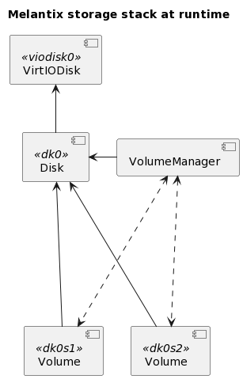

I/O
===

Storage Stack
-------------

   A storage stack that might be created for a VirtIO disk.

In this example storage stack, there is a VirtIODisk (`viodisk0`) at the root of the stack,
which interfaces directly with the hardware (and - not pictured - below it would
be a PCIDevice.) An attached Disk (`dk0`) provides the standard
conveniences. Attached to `dk0` is a VolumeManager, which has detected two GPT
partitions and created and attached two Volumes (`ld0s1` and `ld0s2`).
